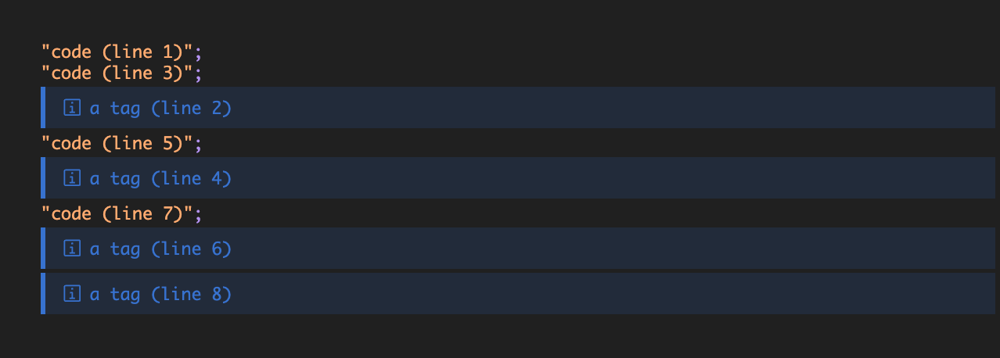
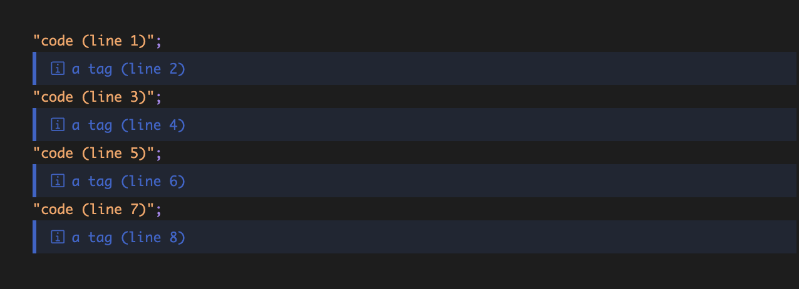

# shiki-twoslash-fix

> A workaround for Shiki's Twoslash transformer that fixes misaligned code annotations and positioning issues

[](https://www.npmjs.com/package/shiki-twoslash-fix)
[](https://www.npmjs.com/package/shiki-twoslash-fix)
[](https://www.typescriptlang.org/)
[](https://opensource.org/licenses/MIT)
[](https://github.com/suin/shiki-twoslash-fix/actions/workflows/ci.yml)
[](https://github.com/suin/shiki-twoslash-fix/actions/workflows/publish.yml)

## The Problem

When using Shiki with Twoslash for syntax highlighting and TypeScript code annotations, you may encounter a bug where code annotations (like `@log:` tags) appear in the wrong positions. This creates confusing and unprofessional-looking documentation.

### Before (Buggy Behavior)

```typescript
"code (line 1)";
// @log: a tag (line 2)
"code (line 3)";
// @log: a tag (line 4)
"code (line 5)";
// @log: a tag (line 6)
"code (line 7)";
// @log: a tag (line 8)
```

**Renders as:**

```
"code (line 1)";
"code (line 3)";
a tag (line 2)    ← Wrong position!
"code (line 5)";
a tag (line 4)    ← Wrong position!
"code (line 7)";
a tag (line 6)    ← Wrong position!
a tag (line 8)    ← Wrong position!
```



### After (Fixed Behavior)

**Renders as:**

```
"code (line 1)";
a tag (line 2)    ← Correct position!
"code (line 3)";
a tag (line 4)    ← Correct position!
"code (line 5)";
a tag (line 6)    ← Correct position!
"code (line 7)";
a tag (line 8)    ← Correct position!
```



## The Solution

This package provides a simple wrapper function that fixes the positioning issues by:

1. **Correcting line number calculations** between Twoslash and Shiki
2. **Removing trailing newlines** that cause layout problems
3. **Adjusting tag node positions** to prevent overflow beyond actual code lines

The fix is **non-invasive** and works with your existing Shiki/Twoslash setup without breaking changes.

## Installation

```bash
# npm
npm install shiki-twoslash-fix

# yarn
yarn add shiki-twoslash-fix

# pnpm
pnpm add shiki-twoslash-fix

# bun
bun add shiki-twoslash-fix
```

## Quick Start

```typescript
import { transformerTwoslash } from "@shikijs/twoslash";
import { twoslashBugWorkaround } from "shiki-twoslash-fix";
import { codeToHast } from "shiki";

// Create the transformer
const transformer = transformerTwoslash();

// Apply the fix
const fixedTransformer = twoslashBugWorkaround(transformer);

// Use it with Shiki
const hast = await codeToHast(code, {
  lang: "ts",
  theme: "min-dark",
  transformers: [fixedTransformer],
});
```

That's it! Your code annotations will now appear in the correct positions.

## Usage Examples

### Basic Usage

```typescript
import { transformerTwoslash } from "@shikijs/twoslash";
import { twoslashBugWorkaround } from "shiki-twoslash-fix";
import { codeToHast } from "shiki";

const code = `
const message = "Hello, World!"
// @log: message
console.log(message)
// @log: "Logging to console"
`;

async function highlightCode() {
  const transformer = transformerTwoslash();
  const fixedTransformer = twoslashBugWorkaround(transformer);

  const hast = await codeToHast(code, {
    lang: "typescript",
    theme: "github-dark",
    transformers: [fixedTransformer],
  });

  return hast;
}
```

### With Multiple Transformers

```typescript
import { transformerTwoslash } from "@shikijs/twoslash";
import { twoslashBugWorkaround } from "shiki-twoslash-fix";
import { transformerNotationDiff } from "@shikijs/transformers";

const transformers = [
  twoslashBugWorkaround(transformerTwoslash()),
  transformerNotationDiff(),
];

const hast = await codeToHast(code, {
  lang: "ts",
  theme: "vitesse-dark",
  transformers,
});
```

### Custom Transformer Configuration

```typescript
import { transformerTwoslash } from "@shikijs/twoslash";
import { twoslashBugWorkaround } from "shiki-twoslash-fix";

const transformer = transformerTwoslash({
  explicitTrigger: true,
  renderer: "rich",
});

const fixedTransformer = twoslashBugWorkaround(transformer);
```

## Technical Details

### Root Cause Analysis

The bug occurs due to two main issues in the interaction between Twoslash and Shiki:

#### 1. Line Number Discrepancy

- **Twoslash** uses the line where a tag is written as the line number
- **Shiki** assumes the line number points to the _next_ line
- This creates an off-by-one error in positioning

#### 2. Trailing Newline Issue

When code ends with `@log:` tags, Twoslash creates trailing newlines that:

- Cause layout problems in the rendered output
- Lead to incorrect line calculations
- Result in tags appearing after all code instead of inline

### Fix Implementation

The [`twoslashBugWorkaround()`](ts/index.ts:16) function works by:

1. **Wrapping the preprocess method** of the transformer
2. **Removing trailing newlines** from the processed code
3. **Adjusting tag node positions** using two corrections:
	- Subtract 1 from line numbers (fixes Twoslash/Shiki discrepancy)
	- Cap line numbers at the maximum actual line (prevents overflow)

```typescript
function adjustTagNodes(nodes, maxLine) {
  for (const node of nodes) {
    if (node.type === "tag") {
      node.line = Math.min(
        node.line - 1, // Fix off-by-one error
        maxLine, // Prevent overflow
      );
    }
  }
}
```

### Edge Cases Handled

- **Empty code blocks**: Gracefully handles empty or whitespace-only code
- **No Twoslash metadata**: Safely passes through when Twoslash isn't used
- **Multiple trailing newlines**: Removes all trailing newlines consistently
- **Mixed content**: Works with code that has both regular lines and annotations

## API Reference

### `twoslashBugWorkaround<T>(transformer: T): T`

Applies the bug workaround to a Shiki transformer that has Twoslash preprocessing.

**Parameters:**

- `transformer: T` - A Shiki transformer object with a `preprocess` method

**Returns:**

- `T` - The same transformer object with the bug fix applied

**Type Constraints:**

- `T extends ShikiTransformer` where `ShikiTransformer` has a `preprocess` method

**Example:**

```typescript
const transformer = transformerTwoslash();
const fixed = twoslashBugWorkaround(transformer);
```

### TypeScript Support

This package is written in TypeScript and provides full type safety:

```typescript
import type { TwoslashShikiReturn } from "@shikijs/twoslash";

// All types are properly exported and inferred
const fixedTransformer = twoslashBugWorkaround(transformer);
// fixedTransformer maintains the same type as the input transformer
```

## Framework Integration

### Astro

```typescript
// astro.config.mjs
import { transformerTwoslash } from "@shikijs/twoslash";
import { twoslashBugWorkaround } from "shiki-twoslash-fix";

export default defineConfig({
  markdown: {
    shikiConfig: {
      transformers: [twoslashBugWorkaround(transformerTwoslash())],
    },
  },
});
```

### Next.js with MDX

```typescript
// next.config.js
import { transformerTwoslash } from "@shikijs/twoslash";
import { twoslashBugWorkaround } from "shiki-twoslash-fix";

const nextConfig = {
  pageExtensions: ["js", "jsx", "mdx", "ts", "tsx"],
  experimental: {
    mdxRs: true,
  },
};

export default withMDX({
  options: {
    remarkPlugins: [],
    rehypePlugins: [
      [
        rehypeShiki,
        {
          transformers: [twoslashBugWorkaround(transformerTwoslash())],
        },
      ],
    ],
  },
})(nextConfig);
```

### VitePress

```typescript
// .vitepress/config.ts
import { transformerTwoslash } from "@shikijs/twoslash";
import { twoslashBugWorkaround } from "shiki-twoslash-fix";

export default defineConfig({
  markdown: {
    codeTransformers: [twoslashBugWorkaround(transformerTwoslash())],
  },
});
```

### Docusaurus

```typescript
// docusaurus.config.js
import { transformerTwoslash } from "@shikijs/twoslash";
import { twoslashBugWorkaround } from "shiki-twoslash-fix";

const config = {
  presets: [
    [
      "classic",
      {
        docs: {
          remarkPlugins: [
            [
              "@docusaurus/remark-plugin-npm2yarn",
              {
                converters: ["yarn", "pnpm"],
              },
            ],
          ],
          rehypePlugins: [
            [
              "rehype-shiki",
              {
                transformers: [twoslashBugWorkaround(transformerTwoslash())],
              },
            ],
          ],
        },
      },
    ],
  ],
};
```

## Compatibility

See the [`peerDependencies` section](package.json) for required versions of `@shikijs/twoslash` and `twoslash`.

## Contributing

Contributions are welcome! Please feel free to submit a Pull Request.

### Development Setup

```bash
# Clone the repository
git clone https://github.com/suin/shiki-twoslash-fix.git
cd shiki-twoslash-fix

# Install dependencies
bun install

# Run tests
bun test

# Build the package
bun run build
```

### Running Tests

The test suite includes both unit tests and integration tests that verify the fix works correctly:

```bash
# Run all tests
bun test

# Run tests in watch mode
bun test --watch
```

### Bug Reports

If you find a bug, please create an issue with:

- A minimal reproduction case
- Your environment details (Node.js version, package versions)
- Expected vs actual behavior

## License

MIT © [suin](https://github.com/suin)
